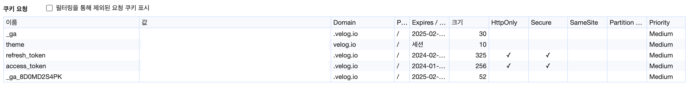

# Cookie

- HTTP 쿠키 (웹 쿠키, 브라우저 쿠키) 라고 불림. 웹 사이트와 마찬가지로 HTTP 프로토콜을 사용해 전송된다.
- 서버 가 생성하여, 클라이언트 의 웹 브라우저에 전송하는 작은 데이터 조각이다
- 브라우저 는 쿠키를 저장해 뒀다가, 동일한 서버에 재 요청 시 저장된 데이터를 함께 전송한다.

## 속성

### Domain

- 쿠키 의 스코프를 지정한다. (어느 도메인에서 유효한지) 이 값은 쿠키가 전송하게 될 호스트 를 명시한다. 도메인이 명시되면, 서브 도메인은 자동적으로 포함된다.

## First-Party (퍼스트 파티 쿠키)

- 쿠키 의 Domain 속성값 과 현재 접속하고 있는 웹사이트의 도메인 이 같은 경우.
- 설정된 도메인에서만 유효하다.
- 예제

  - cool-app.com 이라는 도메인에서 날린 요청의 응답에 쿠키 가 담겨있다. 그 쿠키의 Domain 값이 coo-app.com 혹은 (api.cool-app.com, api2.cool-app.com ...) 이다. 그렇다면 이 쿠키는 퍼스트 파티 쿠키이다.

## Third-Party (써드 파티 쿠키)

- 쿠키 의 Domain 속성값 과 현재 접속하고 있는 웹사이트의 도메인 이 다른 경우.
- 예제

  - cool-app.com 이라는 도메인에서 날린 요청의 응답에 쿠키 가 담겨있다. 그 쿠키의 Domain 값이 some-add.com 이다. 그렇다면 이 쿠키는 써드 파티 쿠키이다.

Reference

- https://developer.mozilla.org/ko/docs/Web/HTTP/Cookies#%EB%B3%B4%EC%95%88

- https://www.youtube.com/watch?v=VOmIplFAGeg
