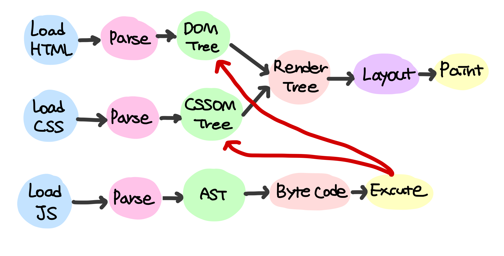

# Rendering

브라우저 에서 하나의 페이지를 렌더링 과정은 다음과 같다.

**1. Load**
- 브라우저는 HTML, CSS, JS, 이미지, 폰트 등 렌더링에 필요한 리소스를 서버에게 요청하여 받는다.

**2. Parsing**

- 브라우저는 HTML 을 파싱하여 DOM TREE 를 생성.
- 동시에, CSS 규칙을 파싱하여 CSSOM(CSS Object Model) 트리를 생성.
- 자바스크립트는 자바스크립트 엔진에 의해 파싱되고 AST 를 생성 하게 됨.

**3. Render Tree**
- Parsing 단계에서 생성된 DOM 트리와 CSSOM 트리를 결합하여 렌더 트리를 생성. 
- Render Tree 는 화면에 보이는 요소들과 그에 맞는 스타일들로 구성됨.
    - 그러므로 `<meta>`, `<script>` 와 같은 비시각적 요소나 `display: none;` 인 요소들은 제외된다.

**4. Painting**
- 렌더 트리를 기반으로 HTML요소의 레이아웃(위치와 크기)을 계산하고, 브라우저 화면에 Painting.

# Repaint
- 요소의 시각적인 변경이 있을 때 발생하지만 레이아웃에는 영향을 주지 않음. e.g. `visibility`, `background-color`, `outline` 등의 변경.

# Reflow
- 브라우저가 각 보이는 요소의 위치와 크기를 계산하는 단계.
- 요소의 레이아웃과 크기 또는 위치가 변경될 때 발생하며, 문서의 일부 또는 전체가 다시 계산됩니다. Reflow가 발생하면 해당 요소뿐만 아니라 그 요소의 자식 및 상위 요소들도 다시 계산된다.

## Triggers
- DOM 노드 의 추가, 삭제 등 DOM 조작을 할 때
- visibility: hidden으로 요소를 숨기면 Repaint만 발생.
- 창 크기를 조절할 때도 Reflow가 발생.
- font-style을 변경하면 요소의 레이아웃과 위치가 변경될 수 있어 Reflow가 발생하고, 그 이후에 Repaint가 발생.
- 스타일시트를 추가하거나 제거하면 Reflow 또는 Repaint가 발생.
- DOM을 조작하는 스크립트는 성능에 큰 영향을 미침. 문서의 일부가 변경될 때마다 Reflow가 발생할 수 있기 때문에, 이는 초당 수천 번 일어날 수 있다.
- 요소 의 위치 를 변경할 때.
    - posiiton 속성의 absolute, fixed 값을 활용하자.
    - `style.top`, `style.left` 속성을 바꾸지 말고, `transform` 속성을 활용하자.

## Javascript DOM API
- 자바스크립트 의 DOM API 는 DOM이나 CSSOM 을 변경할 수 있다. 변경된 DOM과 CSSOM 은 다시 렌더 트리로 결합되며, 이는 Reflow 와 Repaint 를 야기하게 된다.

Reference

[JavaScript | Reflow 란 (feat. 브라우저 렌더링)
](https://velog.io/@heelieben/JavaScript-Reflow-%EB%9E%80-feat.-%EB%B8%8C%EB%9D%BC%EC%9A%B0%EC%A0%80-%EB%A0%8C%EB%8D%94%EB%A7%81)

[Understanding Reflow and Repaint in the browser
](https://dev.to/gopal1996/understanding-reflow-and-repaint-in-the-browser-1jbg)

[DOM 조작을 최소화하여 성능 최적화하기 DocumentFragment
](https://kimfield.tistory.com/entry/DOM-%EC%A1%B0%EC%9E%91%EC%9D%84-%EC%B5%9C%EC%86%8C%ED%99%94%ED%95%98%EC%97%AC-%EC%84%B1%EB%8A%A5-%EC%B5%9C%EC%A0%81%ED%99%94%ED%95%98%EA%B8%B0-DocumentFragment)

[브라우저 작동방식 탐구 - HTML 파서(Parser) 구현하기
](https://velog.io/@elrion018/%EB%B8%8C%EB%9D%BC%EC%9A%B0%EC%A0%80-%EC%9E%91%EB%8F%99%EB%B0%A9%EC%8B%9D-%ED%83%90%EA%B5%AC-HTML-%ED%8C%8C%EC%84%9CParser-%EA%B5%AC%ED%98%84%ED%95%98%EA%B8%B0)